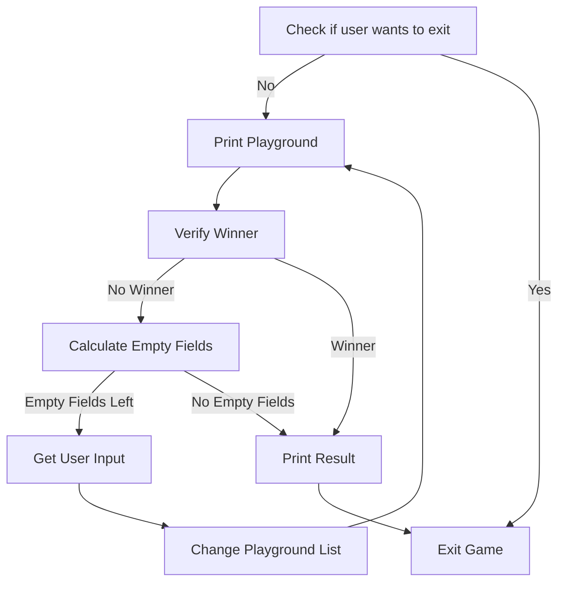

# T2022-0921-2202 Python Tic Tac Toe
#state/closed/2022/9
## Description
Create a tic tac toe game in python.

## Todo
### Plan
Create screen
- Create playground list
    - Create global list with the 9 playground fields.
    - 3x3 fields with content 1 to 9 from upper left to lower right field
- Print playground
    - Fields labeled from 1 to 9, nice boarders
    - Create a list with values = numbers from 1 to 9
    - If a field was set by a player it should display either X or O for the two players
- Verify if won / tied
    - the following list fields have to be the same for a winner
        - 0,1,2
        - 3,4,5
        - 6,7,8
        - 0,4,8
        - 2,4,6
- Get input user1/2
    - Verify if input between 1-9
    - Verify if field is empty
- Set field on playground



## Done

### Code
```python
# Created 2022-09-23
# Version 1.0
# Author: ME

import sys

playground=[ 1,2,3,4,5,6,7,8,9 ]
player="O"
counter=1

def main():
    userinput=""
    while userinput != "e":
        printplayground()
        verifywinner()
        userinput=getinput()
        if userinput:
            setfield(userinput)

def printplayground():
    print(" {} | {} | {}".format(playground[0],playground[1],playground[2]))
    print(" {} | {} | {}".format(playground[3],playground[4],playground[5]))
    print(" {} | {} | {}".format(playground[6],playground[7],playground[8]))

def getinput():
    userinput=input("Bitte Feld nummer eingeben Spieler 1 (e um spiel zu beenden): ")
    if userinput == "e":
        print("Spiel beendet.")
        sys.exit()
    try:
        userinput=int(userinput)
    except ValueError:
        print("Bitte eine Zahl eingeben")
    else:
        if userinput >= 1 and userinput <= 9:
            return userinput
        else:
            print("Zahl muss zwischen 1 und 9 liegen")
            sys.exit()

def setfield(userinput):
    global player
    global counter
    userinput=userinput-1
    if playground[userinput] == "O" or playground[userinput] == "X":
        print("Field {} is already set.".format(playground[userinput]))
    else:
        if counter < 9:
            counter+=1
        else:
            print("No winner. It's a tie.")
            sys.exit()
        playground[userinput]=player
        if player == "X":
            player="O"
        else:
            player="X"

def  verifywinner():
    if playground[0] == playground[1] == playground [2]:
        print("Player {} has won!".format(playground[0]))
        sys.exit()
    if playground[0] == playground[3] == playground [6]:
        print("Player {} has won!".format(playground[0]))
        sys.exit()
    if playground[1] == playground[4] == playground [7]:
        print("Player {} has won!".format(playground[0]))
        sys.exit()
    if playground[2] == playground[5] == playground [8]:
        print("Player {} has won!".format(playground[0]))
        sys.exit()
    if playground[3] == playground[4] == playground [5]:
        print("Player {} has won!".format(playground[3]))
        sys.exit()
    if playground[6] == playground[7] == playground [8]:
        print("Player {} has won!".format(playground[6]))
        sys.exit()
    if playground[0] == playground[4] == playground [8]:
        print("Player {} has won!".format(playground[0]))
        sys.exit()
    if playground[2] == playground[4] == playground [6]:
        print("Player {} has won!".format(playground[2]))
        sys.exit()

if __name__ == "__main__":
    main()import sys

playground=[ 1,2,3,4,5,6,7,8,9 ]
player="O"
counter=1

def main():
    userinput=""
    while userinput != "e":
        printplayground()
        verifywinner()
        userinput=getinput()
        if userinput:
            setfield(userinput)

def printplayground():
    print(" {} | {} | {}".format(playground[0],playground[1],playground[2]))
    print(" {} | {} | {}".format(playground[3],playground[4],playground[5]))
    print(" {} | {} | {}".format(playground[6],playground[7],playground[8]))

def getinput():
    userinput=input("Bitte Feld nummer eingeben Spieler 1 (e um spiel zu beenden): ")
    if userinput == "e":
        print("Spiel beendet.")
        sys.exit()
    try:
        userinput=int(userinput)
    except ValueError:
        print("Bitte eine Zahl eingeben")
    else:
        if userinput >= 1 and userinput <= 9:
            return userinput
        else:
            print("Zahl muss zwischen 1 und 9 liegen")
            sys.exit()

def setfield(userinput):
    global player
    global counter
    userinput=userinput-1
    if playground[userinput] == "O" or playground[userinput] == "X":
        print("Field {} is already set.".format(playground[userinput]))
    else:
        if counter < 9:
            counter+=1
        else:
            print("No winner. It's a tie.")
            sys.exit()
        playground[userinput]=player
        if player == "X":
            player="O"
        else:
            player="X"

def  verifywinner():
    if playground[0] == playground[1] == playground [2]:
        print("Player {} has won!".format(playground[0]))
        sys.exit()
    if playground[0] == playground[3] == playground [6]:
        print("Player {} has won!".format(playground[0]))
        sys.exit()
    if playground[1] == playground[4] == playground [7]:
        print("Player {} has won!".format(playground[0]))
        sys.exit()
    if playground[2] == playground[5] == playground [8]:
        print("Player {} has won!".format(playground[0]))
        sys.exit()
    if playground[3] == playground[4] == playground [5]:
        print("Player {} has won!".format(playground[3]))
        sys.exit()
    if playground[6] == playground[7] == playground [8]:
        print("Player {} has won!".format(playground[6]))
        sys.exit()
    if playground[0] == playground[4] == playground [8]:
        print("Player {} has won!".format(playground[0]))
        sys.exit()
    if playground[2] == playground[4] == playground [6]:
        print("Player {} has won!".format(playground[2]))
        sys.exit()

if __name__ == "__main__":
    main()
```

### 2022-09-21
- Created Task
