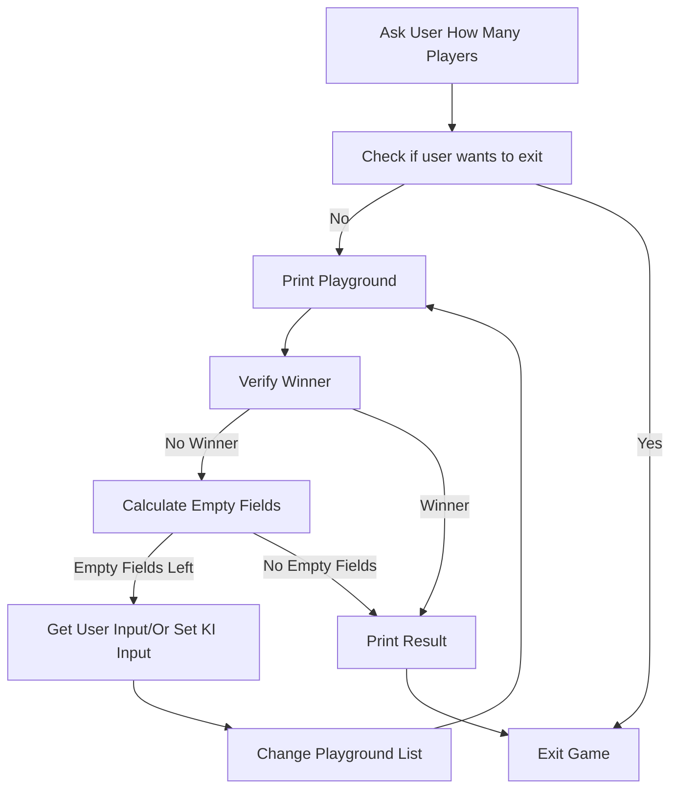

# T2022-0923-0946 TicTacToe with AI (Computer Player)
#state/closed/2022/9
## Description
Use the basic [[T2022-0921-2202 Python Tic Tac Toe]] and add the possibility to play against the computer. Or create a computer only game.

## Todo
- Instead of get user input, the computer will select a random field.
- Ask user how many human players (either 1,2 or 0 (for computer only gamge))
- Set a computer variable
- in get user input function check if variable is set and do either get input or make a computer random choide.


## Done
### 2022-09-23
- Created Task

### Code
```python
# Created 2022-09-23
# Version 1.0
# Author: ME

import sys,random

playground=[ 1,2,3,4,5,6,7,8,9 ]
player=["O","h"]
counter=1

def main():
    userinput=""
    players=input("Select either 1 or 2 (for the number of human players) or 0 for a computer versus computer game: ")
    while userinput != "e":
        printplayground()
        verifywinner()
        userinput=getinput(players)
        if userinput:
            setfield(userinput)

def printplayground():
    print(" {} | {} | {}".format(playground[0],playground[1],playground[2]))
    print(" {} | {} | {}".format(playground[3],playground[4],playground[5]))
    print(" {} | {} | {}".format(playground[6],playground[7],playground[8]))

def getinput(players):
    if players == "2":
        userinput=input("Bitte Feldnummer (1-9) eingeben Spieler {} (oder 'e' um das Spiel zu beenden): ".format(player[0]))
    elif players == "1" and player[0] == "O":
        userinput=input("Bitte Feldnummer (1-9) eingeben Spieler {} (oder 'e' um das Spiel zu beenden): ".format(player[0]))
    else:
        userinput=random.randint(1,9)
    if userinput == "e":
        print("Spiel beendet.")
        return userinput
    try:
        userinput=int(userinput)
    except ValueError:
        print("Bitte eine Zahl eingeben")
    else:
        if userinput >= 1 and userinput <= 9:
            print("Player {} sets position {}".format(player[0],userinput))
            return userinput
        else:
            print("Zahl muss zwischen 1 und 9 liegen")
            sys.exit()

def setfield(userinput):
    global player
    global counter
    userinput=userinput-1
    if playground[userinput] == "O" or playground[userinput] == "X":
        print("Field {} is already set.".format(playground[userinput]))
    else:
        if counter < 9:
            counter+=1
        else:
            print("No winner. It's a tie.")
            sys.exit()
        playground[userinput]=player[0]
        if player[0] == "X":
            player[0]="O"
        else:
            player[0]="X"

def  verifywinner():
    if playground[0] == playground[1] == playground [2]:
        print("Player {} has won!".format(playground[0]))
        sys.exit()
    if playground[0] == playground[3] == playground [6]:
        print("Player {} has won!".format(playground[0]))
        sys.exit()
    if playground[1] == playground[4] == playground [7]:
        print("Player {} has won!".format(playground[0]))
        sys.exit()
    if playground[2] == playground[5] == playground [8]:
        print("Player {} has won!".format(playground[0]))
        sys.exit()
    if playground[3] == playground[4] == playground [5]:
        print("Player {} has won!".format(playground[3]))
        sys.exit()
    if playground[6] == playground[7] == playground [8]:
        print("Player {} has won!".format(playground[6]))
        sys.exit()
    if playground[0] == playground[4] == playground [8]:
        print("Player {} has won!".format(playground[0]))
        sys.exit()
    if playground[2] == playground[4] == playground [6]:
        print("Player {} has won!".format(playground[2]))
        sys.exit()

if __name__ == "__main__":
    main()
```
